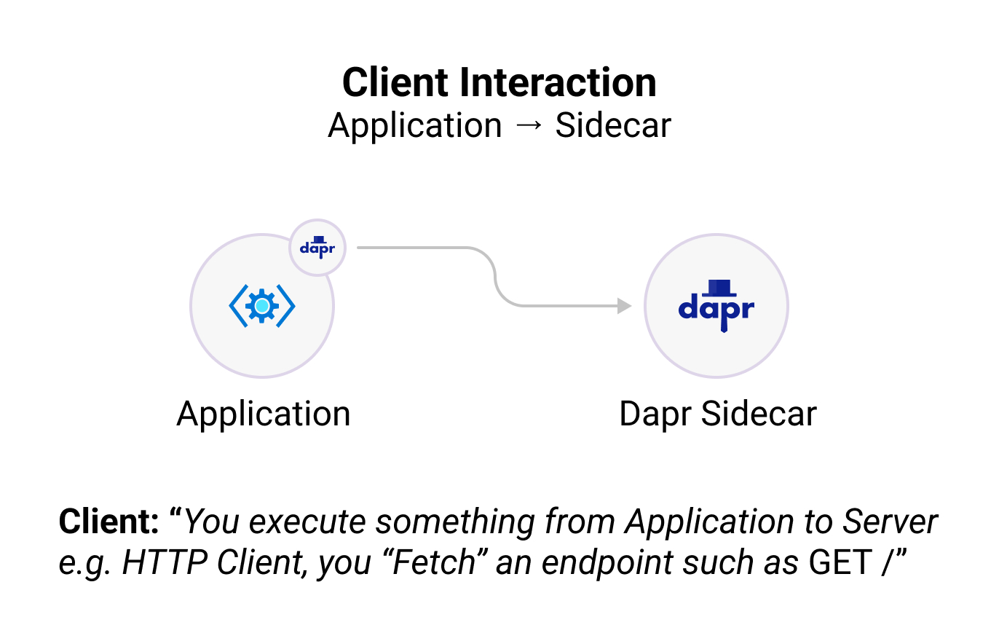

A client library for building Dapr apps in JavaScript and TypeScript. This client abstracts the public Dapr APIs like service to service invocation, state management, pub/sub, secrets, and much more, and provides a simple, intuitive API for building applications.

## Installation

To get started with the JavaScript SDK, install the Dapr JavaScript SDK package from [NPM](https://www.npmjs.com/package/@dapr/dapr):

```bash
npm install --save @dapr/dapr
```

## Structure

The Dapr JavaScript SDK contains two major components:

- **DaprServer**: to manage all Dapr sidecar to application communication.
- **DaprClient**: to manage all application to Dapr sidecar communication.

The above communication can be configured to use either of the gRPC or HTTP protocols.

<table>
  <tr>
  <td bgcolor="white">  </td>
  <td bgcolor="white">  </td>
  </tr>
</table>

## Getting Started

To help you get started, check out the resources below:

<div class="card-deck">
  <div class="card">
    <div class="card-body">
      <h5 class="card-title"><b>Client</b></h5>
      <p class="card-text">Create a JavaScript client and interact with the Dapr sidecar and other Dapr applications (e.g., publishing events, output binding support, etc.). </p>
      <a href="" class="stretched-link"></a>
    </div>
  </div>
  <div class="card">
    <div class="card-body">
      <h5 class="card-title"><b>Server</b></h5>
      <p class="card-text">Create a JavaScript server and let the Dapr sidecar interact with your application (e.g., subscribing to events, input binding support, etc.). </p>
      <a href="" class="stretched-link"></a>
    </div>
  </div>
  <div class="card">
    <div class="card-body">
      <h5 class="card-title"><b>Actors</b></h5>
      <p class="card-text">Create virtual actors with state, reminders/timers, and methods.</p>
      <a href="" class="stretched-link"></a>
    </div>
  </div>
</div>
<br />
<div class="card-deck">
  <div class="card">
    <div class="card-body">
      <h5 class="card-title"><b>Logging</b></h5>
      <p class="card-text">Configure and customize the SDK logging.</p>
      <a href="" class="stretched-link"></a>
    </div>
  </div>
  <div class="card">
    <div class="card-body">
      <h5 class="card-title"><b>Examples</b></h5>
      <p class="card-text">Clone the JavaScript SDK source code and try out some of the examples to get started quickly.</p>
      <a href="" class="stretched-link"></a>
    </div>
  </div>
</div>
