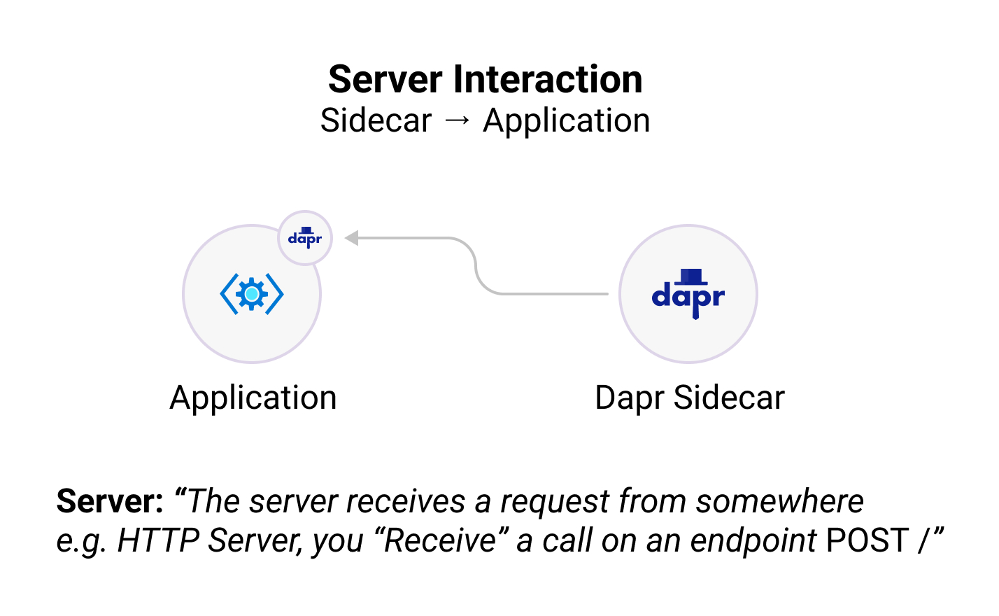

The Dapr JS SDK will allow you to interface with the Dapr process that abstracts several commonly used functionalities such as Service-to-Service invocation, State Management, PubSub, and more.

## Installation

To get started with the Javascript SDK, you can download the Dapr Javascript SDK package from [NPM](https://npmjs.org/package/dapr-client) by running the following:

```bash
npm install --save dapr-client
```

## Structure

The Dapr Javascript SDK contains two major components: 

* **DaprServer:** The Dapr Server manages all communication from the Dapr Sidecar to your application
* **DaprClient:** The Dapr Client manages all communication from your application to the Dapr Sidecar

The above communication can be configured to use either of the gRPC or HTTP protocols.




## Get Started

To help you get started, check out the resources below:

<div class="card-deck">
  <div class="card">
    <div class="card-body">
      <h5 class="card-title"><b>Client</b></h5>
      <p class="card-text">Create a JavaScript client and interact with a Dapr sidecar and other Dapr applications. (e.g., publishing events, output binding support, etc.)</p>
      <a href="" class="stretched-link"></a>
    </div>
  </div>
  <div class="card">
    <div class="card-body">
      <h5 class="card-title"><b>Server</b></h5>
      <p class="card-text">Create a JavaScript server and let the Dapr sidecar interact with your application. (e.g., subscribing to events, input binding support, etc.)</p>
      <a href="" class="stretched-link"></a>
    </div>
  </div>
  <div class="card">
    <div class="card-body">
      <h5 class="card-title"><b>Actors</b></h5>
      <p class="card-text">Create virtual actors with state, reminders/timers, and methods in JavaScript.</p>
      <a href="" class="stretched-link"></a>
    </div>
  </div>
  <div class="card">
    <div class="card-body">
      <h5 class="card-title"><b>Examples</b></h5>
      <p class="card-text">Clone the JavaScript SDK repo and try out some of the examples and get started quickly.</p>
      <a href="https://github.com/dapr/js-sdk/blob/master/documentation/examples.md" class="stretched-link"></a>
    </div>
  </div>
</div>

### Available packages
- [DaprClient]() is a package that for how your application interacts with the Dapr sidecar, or other Dapr powered applications.

- [DaprServer]() is a package for how the Dapr sidecar interacts with your application, forwarding event subscriptions, invokes and more.
