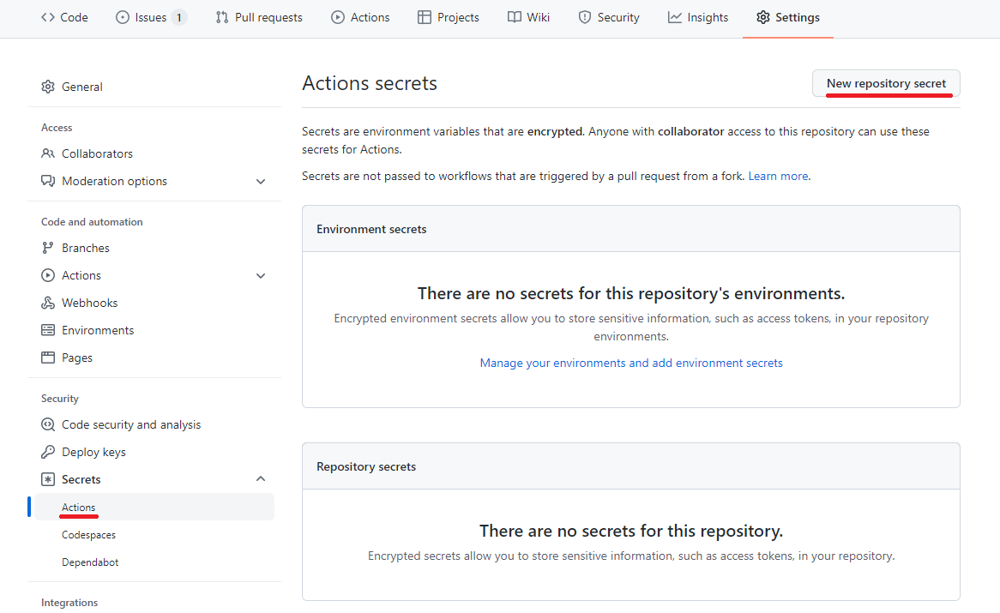

# Development

The notes below help for developing the library locally.

## Installation

Run the following commands to configure the library

> ⚠ Make sure to have Dapr installed

```bash
npm install
```

## Running the Library

The command below runs the build process and will rebuild each time we change a file. This comes in handy when checking issues.

```bash
npm run start:dev
```

## Publishing Package Package Maintenance

To publish a new package to [https://www.npmjs.com/package/@dapr/dapr](https://www.npmjs.com/package/@dapr/dapr) we need to do the following building and publishing steps.

For **building** a new version, we:
- update the version in `package.json` in the repo root, e.g. `3.4.0` for a final releaes or `3.4.0-rc.1` for a pre-release
- run `npm install` again to refresh lock file (it should now be dirty and part of the change list)
- verify the dapr runtime and versions in [./scripts/fetch-proto.sh](./scripts/fetch-proto.sh) and update if necessary
- run `./scripts/fetch-proto.sh` from the repo root to regenerate protos to match runtime
- verify [.github/workflows/test-e2e.yml](.github/workflows/test-e2e.yml) env variables, especially the Dapr and Node versions to test against

PR this change into the right release branch, e.g. `release-3.4.0`.  Merging to `master` branch should happen last.  

A custom script is utilized here since we have 2 libraries in one for HTTP and gRPC

For **publishing** the package, we simply cut a new release by:
- create a new release/tag in the dapr/js-sdk repo
  - for a final release the tag should look like `v3.4.0` and mark it as final official release.  Generate release notes using the N-1 released version, e.g. using 3.3.1. 
  - for a pre-release it should look like `v3.4.0-rc.1` and mark it as a pre-release
- verify the package is now uploaded to [https://www.npmjs.com/package/@dapr/dapr](https://www.npmjs.com/package/@dapr/dapr) and shows the new version 

Publishing is automated in the CI/CD pipeline. Each time a version is release (GitHub ref starting with `refs/tags/v`) then the pipeline will deploy the package as described in [build.yml](./.github/workflows/build.yml).

## Running Tests

Tests are written per protocol layer: http or grpc. This is done because Dapr requires endpoints to be registered for for pubsub and bindings, making us having to start up the test, initialize those endpoints and then run. Since Dapr is a sidecar architecture, we thus have to start 2 test suites seperately. It requires the following containers:

- **EMQX:** Used for Binding Tests
  - Credentials: http://localhost:18083 (user: admin, pass: public)
- **MongoDB:** Used for State Query API

```bash
# Start Container
docker run -d --rm --name emqx -p 1883:1883 -p 8081:8081 -p 8083:8083 -p 8883:8883 -p 8084:8084 -p 18083:18083 emqx/emqx
docker run -d --rm --name mongodb -p 27017:27017 mongo

# Run Unit Tests
npm run test:unit:main
npm run test:unit:actors

# Start gRPC tests
npm run test:e2e:grpc

# Start HTTP tests
npm run test:e2e:http
```

## Setup GitHub actions

1. Fork the [js-sdk](https://github.com/dapr/js-sdk) repo to your GitHub account.
1. Go to `Settings` in the forked repo and click on `Secrets` -> `Action`:
   
1. Add secret variables for Dapr CI

| Secret         | Value                                                                                                                                                | Usage                                                                                                                      |
| -------------- | ---------------------------------------------------------------------------------------------------------------------------------------------------- | -------------------------------------------------------------------------------------------------------------------------- |
| DAPR_BOT_TOKEN | [Your Github Personal Access Token](https://docs.github.com/en/authentication/keeping-your-account-and-data-secure/creating-a-personal-access-token) | [dapr-bot.yml](https://github.com/dapr/js-sdk/blob/main/.github/workflows/dapr-bot.yml) uses it for administrative actions |
