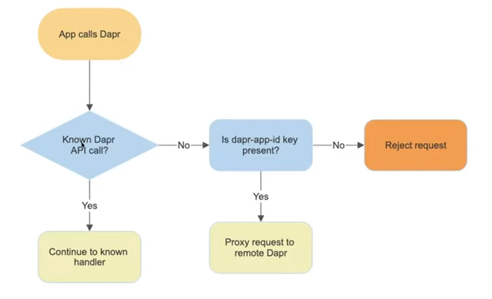

We support gRPC proxying as shown in [community call 41](https://www.youtube.com/watch?v=B_vkXqptpXY&t=71s).

## How the JS SDK Supports this

## Behind the Scenes (Technical Working)



1. The gRPC service gets started in Dapr. We tell Dapr which port this gRPC server is running on through `--app-port` and give it a unique Dapr APP Id with `--app-id <APP_ID_HERE>`
2. We can now call the Dapr Sidecar through a client that will connect to the Sidecar
3. Whilst calling the Dapr Sidecar, we provide a metadata key named `dapr-app-id` with the value of our gRPC server booted in Dapr (e.g. `server` in our example)
4. Dapr will now forward the call to the gRPC server configured

## Example

The example provided is based on the Hello World example, where we have a server and a client. The server will just reply what the client sends.

```bash
client/     # The client calling the gRPC server (through the Dapr JS SDK)
server/     # The gRPC server
helloworld/ # Contains our Proto description
```

We will be using this proto file:
https://github.com/grpc/grpc-go/blob/master/examples/helloworld/helloworld/helloworld.proto

### Start Server

```bash
cd server/
./start.sh
```

### Start Client

```bash
cd client/
./start.sh
```
