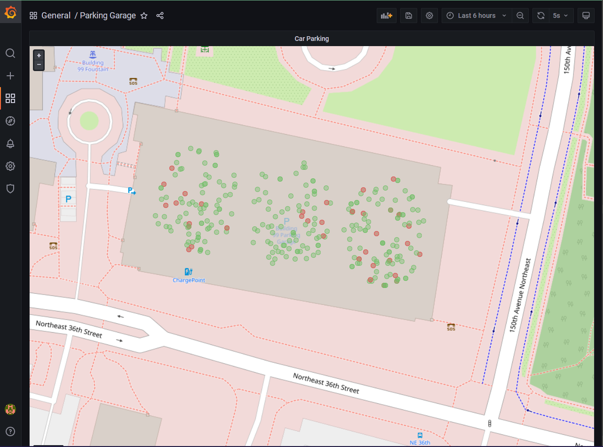

# Actor Parking Sensor

This example shows a car parking area where cars (virtual actors) enter and leave randomly. The car sensor data is sent via Dapr actors to InfluxDB and displayed on Grafana.

## Prerequisites

Start influxdb, telegraf and grafana using docker-compose. 

```bash
docker-compose up
```

## Running

```bash
# Build the Source (from the root)
./build.sh

# Install (from the example directory)
npm install

# Build and run the example
npm run build
npm run start:dapr
```

## Visualize

Start grafana on localhost:3001 and use `admin`/`password` to login and visualize the dashboard!

Sample:


## References
1. Original blog post: https://xaviergeerinck.com/post/2021/10/09/parking-garage
1. Influx/Telgraf/Grafana setup inspired from: https://github.com/bcremer/docker-telegraf-influx-grafana-stack